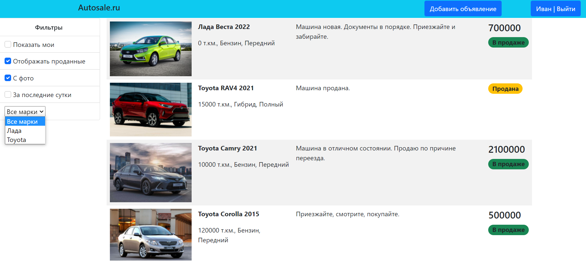
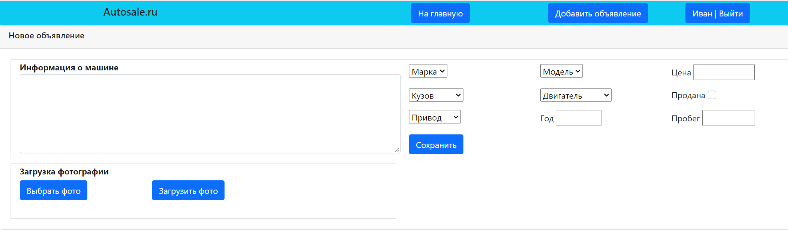
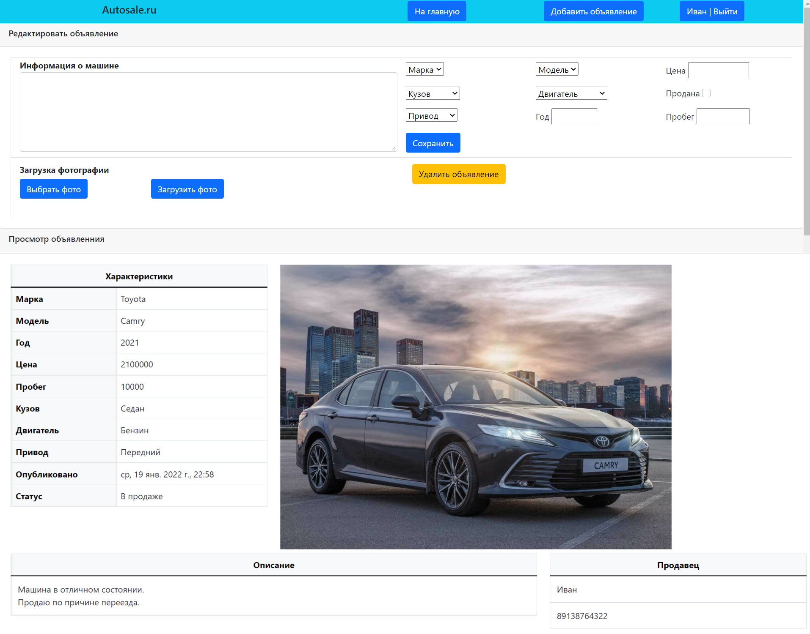

# job4j_cars
## О проекте

Это приложение - площадка продаж автомобилей.

Незарегистрированные пользователи имеют возможность просматривать все объявления.

Зарегистрированные пользователи  могут добавлять, редактировать и удалять свои объявления.

## Обзор
Главная страница.

Страница объявления.

Страница добавления объявления.

Страница редактирования объявления.

## Настройка и сборка

У приложения два файла конфигурации: /src/main/resources/hibernate.cfg.xml и

/src/main/resources/cars.properties, в первом необходимо указать настройки Hibernate, во втором

путь к директории, куда будут сохраняться фотографии автомобилей.

Сборка осуществляется командой: mvn package.

После сборки приложение нужно развернуть в контейнере сервлетов и настроить сервер баз данных.

## Контакты

Email: kostasc@mail.ru
Telegram: @rkostashchuk